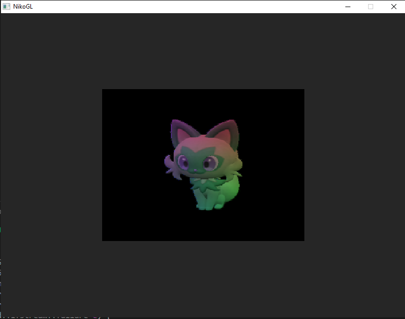

# OpenGL-Renderer
An OpenGL renderer using SDL for windowing and input processing. This is a work in progress. Compiles on Windows with `mingw32-make`. 

### Creating custom scenes
To create new scenes, add a scene header file in the scenes folder that extends the abstract scene base class. The new scene should implement a load function for creating and loading objects such as textures, meshes, and shaders; an unload function, and a custom render function. 

#### Creating and using custom shaders
Implement your GLSL shaders and add them to the shaders folder. To use them in your scene, load them using the shader object. 

#### Scene management and scene transitions
Push your new scene file to the scene vector in the scene manager header file. When playing the game, to change scenes, press the `right` arrow key. So far, there are no observable performance drops through RenderDoc when transitioning between scenes.

### Rotating Camera

Camera class implemented. User can customize the position, target, and up-direction. 

#### Performance on many cubes

The current code achieves around 2000 FPS on average, 1500 FPS in this screenshot with a typical frame time of less than 1 ms. The same as just one single cube. This capture is taken using RenderDoc.

### Perspective Correction
 

Shader now multiplies `projection * view * model` matrices, the view matrix corrects the perspective. 

### 3D Transformations

Support for 3D transformations with matrices and vectors.

#### Current performance

The current code achieves around 2000 FPS on average, 1500 FPS in this screenshot with a typical frame time of less than 1 ms. This capture is taken using RenderDoc.

### Textures Demo - A wild Sprigatito has appeared!~
|100% Empty Box|Mix|100% Sprigatito|
|:-------:|:--------:|:--------:|
|||

Support for texture mapping. Press the `up` arrow key to shift the texture towards sprigatito, and `down` to shift towards the crate.

### (Shaders) Drawing triangles
|Solid|Solid|Wireframe|
|:---:|:----:|:------:|
||||

Support for shaders.

<!-- 
For future reference: the VBO stores the vertices, the EBO stores the vertex indices for each triangle, and the VAO specifies the settings for OpenGL to draw the triangles.
-->

### Libraries and APIs
<li>
<a href="https://www.khronos.org/opengl/">OpenGL </a> Khronos Specifications. The Khronos Group Inc.
</li>
<li>
<a href="https://github.com/Dav1dde/glad">GLAD</a> to access OpenGL functions. David Herberth.
<li>
<a href="https://github.com/libsdl-org/SDL">Simple DirectMedia Layer</a> (SDL) for windowing and input. Sam Lantinga <slouken@libsdl.org>.
</li>
<li>
<a href="https://github.com/nothings/stb/blob/master/stb_image.h">stb_image.h</a> for loading textures in OpenGL. <a href="https://github.com/nothings">Sean Barrett</a>.
</li>
<li>
<a href="https://glm.g-truc.net/0.9.8/index.html">GLM</a> for vector and matrix data structures and operations.
</li>
<!--
<li>
<a href="https://github.com/libsdl-org/SDL_image">SDL_image</a> for image decoding (might use later). Sam Lantinga <slouken@libsdl.org>
</li> 
-->

### Graphics
<li>
<a href="https://pokemon-scarlet-and-violet.fandom.com/wiki/Sprigatito">Sprigatito</a>
</li>
<li>
<a href="https://learnopengl.com/img/textures/container.jpg">Wooden Container</a>
</li>
